# API Personas - Spring Boot

API REST para gestionar personas con CRUD completo.

## Arquitectura Hexagonal (Ports & Adapters)

```mermaid
graph TB
    subgraph "INFRASTRUCTURE (Adaptadores)"
        direction TB
        REST["🌐 PersonaController<br/>(Adaptador de Entrada - REST)"]
        EXH["⚠️ GlobalExceptionHandler<br/>(Manejo de errores HTTP)"]
        JPA["🗄️ PersonaRepositoryAdapter<br/>(Adaptador de Salida - JPA)"]
        ENT["📋 PersonaEntity<br/>(Entidad JPA)"]
        REPO["🔧 PersonaJpaRepository<br/>(Spring Data)"]
        JPA --> ENT
        JPA --> REPO
    end

    subgraph "APPLICATION (Casos de Uso)"
        direction TB
        subgraph "Puertos de Entrada (Driving)"
            PI_REG["IRegistrarService"]
            PI_LIS["IListarService"]
            PI_BUS["IBuscarService"]
            PI_ACT["IActualizarService"]
            PI_ELI["IEliminarService"]
        end
        subgraph "Puertos de Salida (Driven)"
            PO_REPO["PersonaRepositoryPort"]
        end
        subgraph "Servicios"
            S_CRE["CrearService"]
            S_LIS["ListarService"]
            S_BUS["BuscarService"]
            S_ACT["ActualizarService"]
            S_ELI["EliminarService"]
            S_VAL["ValidarEmailService"]
            S_CON["ConvertirService"]
        end
        S_CRE -.->|implementa| PI_REG
        S_LIS -.->|implementa| PI_LIS
        S_BUS -.->|implementa| PI_BUS
        S_ACT -.->|implementa| PI_ACT
        S_ELI -.->|implementa| PI_ELI
    end

    subgraph "DOMAIN (Núcleo de Negocio)"
        direction TB
        MOD["👤 Persona<br/>(POJO puro)"]
        EX1["❌ PersonaNoEncontradaException"]
        EX2["❌ EmailDuplicadoException"]
    end

    REST -->|"usa"| PI_REG
    REST -->|"usa"| PI_LIS
    REST -->|"usa"| PI_BUS
    REST -->|"usa"| PI_ACT
    REST -->|"usa"| PI_ELI
    EXH -.->|"captura"| EX1
    EXH -.->|"captura"| EX2

    S_CRE -->|"usa"| PO_REPO
    S_LIS -->|"usa"| PO_REPO
    S_BUS -->|"usa"| PO_REPO
    S_ACT -->|"usa"| PO_REPO
    S_ELI -->|"usa"| PO_REPO
    S_VAL -->|"usa"| PO_REPO

    JPA -.->|"implementa"| PO_REPO

    S_CRE -->|"usa"| MOD
    S_BUS -->|"lanza"| EX1
    S_VAL -->|"lanza"| EX2

    style REST fill:#4CAF50,color:#fff
    style JPA fill:#2196F3,color:#fff
    style MOD fill:#FF9800,color:#fff
    style PO_REPO fill:#9C27B0,color:#fff
    style PI_REG fill:#9C27B0,color:#fff
    style PI_LIS fill:#9C27B0,color:#fff
    style PI_BUS fill:#9C27B0,color:#fff
    style PI_ACT fill:#9C27B0,color:#fff
    style PI_ELI fill:#9C27B0,color:#fff
```



### Regla de Dependencia

```
infrastructure → application → domain
(frameworks)     (casos de uso)  (puro Java, sin dependencias externas)
```

| Capa | Depende de | NO depende de |
|------|-----------|---------------|
| `domain/` | Nada (Java puro) | Spring, JPA, HTTP |
| `application/` | `domain` | Spring Web, JPA, BD |
| `infrastructure/` | `application` + `domain` + frameworks | — |

### Estructura de Paquetes

```
src/main/java/
├── domain/                          ← Núcleo de negocio (sin frameworks)
│   ├── model/Persona.java           (POJO puro)
│   └── exception/                   (excepciones de dominio)
├── application/                     ← Casos de uso
│   ├── port/in/                     (puertos de entrada - interfaces)
│   ├── port/out/                    (puertos de salida - interfaces)
│   ├── dto/PersonaDTO.java          (transferencia de datos)
│   └── service/                     (implementaciones de casos de uso)
└── infrastructure/                  ← Adaptadores técnicos
    ├── controller/                  (adaptador REST - entrada)
    └── persistence/                 (adaptador JPA - salida)
```

## Endpoints

| Método | URL | Qué hace |
|--------|-----|----------|
| POST | `/api/personas` | Registra una persona nueva |
| GET | `/api/personas` | Lista todas las personas |
| GET | `/api/personas/{id}` | Busca una persona por ID |
| PUT | `/api/personas/{id}` | Actualiza una persona |
| DELETE | `/api/personas/{id}` | Elimina una persona |


## Principios SOLID aplicados

### S - Single Responsibility (Responsabilidad Única)

Básicamente cada clase hace UNA sola cosa y ya. No hay clases "toderas" que hagan de todo.

| Clase | Su única responsabilidad |
|-------|--------------------------|
| `PersonaService` | Solo registrar personas nuevas |
| `ListarService` | Solo listar todas las personas |
| `BuscarService` | Solo buscar personas por ID |
| `ActualizarService` | Solo actualizar una persona |
| `EliminarService` | Solo eliminar una persona |
| `ValidarEmailService` | Solo validar que el email no esté repetido |
| `PersonaController` | Solo recibir las peticiones HTTP y delegar |
| `GlobalExceptionHandler` | Solo manejar los errores |

**Antes** todo estaba metido en un solo `PersonaService` gigante. **Ahora** si necesito cambiar cómo se elimina una persona, solo toco `EliminarService` sin miedo a romper el registro o la búsqueda.

### O - Open/Closed (Abierto/Cerrado)

El sistema está **abierto para extender** pero **cerrado para modificar**. ¿Qué significa? Que si mañana quiero cambiar cómo se listan las personas (por ejemplo, listar solo las activas), creo una nueva clase `ListarActivosService` que implemente `IListarService` y listo. No tengo que tocar ni una línea del `ListarService` original ni del controller.


### L - Liskov Substitution (Sustitución de Liskov)

Cualquier clase que implemente una interfaz puede reemplazar a otra implementación sin que nada se rompa. El `PersonaController` no sabe si está usando `BuscarService` o una clase distinta, solo sabe que recibe algo que cumple con `IBuscarService`.

Por ejemplo, si creo `BuscarConCacheService implements IBuscarService`, lo puedo poner en lugar del `BuscarService` normal y todo sigue funcionando igual.

### I - Interface Segregation (Segregación de Interfaces)

Las interfaces son **pequeñas y específicas**. No hay una interfaz gigante `IPersonaService` con 10 métodos donde cada clase solo usa 2.

| Interfaz | Métodos |
|----------|---------|
| `IRegistrarService` | `registrar()` |
| `IListarService` | `listarPersonas()` |
| `IBuscarService` | `buscarId()`, `buscarPorId()` |
| `IActualizarService` | `actualizar()` |
| `IEliminarService` | `eliminar()` |
| `IValidarEmailService` | `validarEmailUnico()` |

Cada interfaz tiene solo lo que necesita, nada más. Si un servicio solo necesita buscar, depende solo de `IBuscarService`, no de toda una interfaz con métodos que no va a usar.

### D - Dependency Inversion (Inversión de Dependencias)

Las clases dependen de **interfaces** (abstracciones), no de las implementaciones concretas. Nadie hace `new BuscarService()` directamente, Spring se encarga de inyectar la implementación correcta.

```java
// ANTES (dependía de la clase concreta)
private final BuscarService buscarService;

// AHORA (depende de la interfaz)
private final IBuscarService buscarService;
```

**¿Dónde se ve esto?**
- `PersonaController` → depende de `IRegistrarService`, `IListarService`, `IBuscarService`, `IActualizarService`, `IEliminarService`
- `ActualizarService` → depende de `IBuscarService` y `IValidarEmailService`
- `EliminarService` → depende de `IBuscarService`
- `PersonaService` → depende de `IValidarEmailService`

Spring inyecta las implementaciones automáticamente por constructor. Esto hace que testear sea muy fácil porque podemos meter mocks de las interfaces en los tests.
